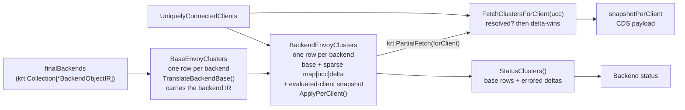

# EP-14184: Shared Base Clusters with Per-Client Overlays

- Issue: [#14184](https://github.com/kgateway-dev/kgateway/issues/14184)
- Originating PR: [#14343](https://github.com/kgateway-dev/kgateway/pull/14343) (superseded by the stack in [Delivery](#delivery))
- Predecessors: [#14104](https://github.com/kgateway-dev/kgateway/pull/14104), [#14317](https://github.com/kgateway-dev/kgateway/pull/14317)
- Related: [#13586](https://github.com/kgateway-dev/kgateway/issues/13586) (the *backends* axis of the same scaling problem)

## Background

kgateway serves a distinct xDS snapshot to every *uniquely connected client* (UCC). A UCC is
a bucket of Envoy streams that share a role, namespace, locality, augmented pod labels, and
local-cluster capability — the inputs that can legitimately change what config a proxy should
receive. Any Envoy whose locality or labels differ gets its own UCC.

Before this EP, the cluster half of that per-client pipeline forked the **entire** backend
translation for every `(backend, client)` pair:

```go
// pkg/kgateway/proxy_syncer/backends.go, before
for _, ucc := range krt.Fetch(kctx, uccs) {
    c, err := translator.TranslateBackend(ctx, kctx, ucc, backendObj) // full translation
    ...                                                              // one KRT row per pair
}
```

`TranslateBackend` builds the cluster from scratch: `initializeCluster`, the backend plugin's
`InitEnvoyBackend`, DNS lookup family, every `ProcessBackend` policy hook, the Gateway backend
client certificate, and — in strict mode — a full Envoy bootstrap validation. Almost none of
that depends on the client. The parts that genuinely do are small and rare:

- a destination rule whose `workloadSelector` matches this proxy's labels (outlier detection,
  locality LB, TCP keepalive);
- the ambient waypoint ingress redirect, which rewrites an EDS cluster into a STATIC one; and
- an inline `ClusterLoadAssignment`, whose endpoint priorities are computed from the client's
  locality by `PrioritizeEndpoints`.

With `N` connected client shapes and `M` backends, the control plane therefore performed
`O(N*M)` full translations and retained `O(N*M)` KRT rows, each holding an independently
allocated `Cluster` proto, and recomputed all of it whenever a client connected or
disconnected. #14184 is the incident that made this visible: a fleet with 15 UCCs multiplied
every backend's translation by 15, and the resulting CPU and GC pressure interacted badly with
the per-client readiness gates that were later reverted in #14380.

`gatewayScopedBackend` (the Gateway-backend-client-certificate variant collection) shows what
the right shape looks like: a rare, structurally-required fork expressed as a *separate row*
rather than as a multiplier on every row. This EP applies the same idea to per-client
translation.

## Motivation

Per-client cluster state is the dominant term in kgateway's control-plane footprint on large
clusters, and it grows in the one dimension operators cannot control: how many distinct Envoy
shapes are connected. Two operational consequences follow.

**Cost.** Translation cost and retained memory both scale with `N*M` even though the
per-client *difference* is usually empty. Duplicate `Cluster` protos dominate the KRT store,
and each is re-marshalled for hashing on every recompute.

**Blast radius.** Because every `(client, backend)` pair is one row in one flat collection,
one client's churn invalidates the whole collection, and any consumer that waits for
coherence waits on the whole fleet. That coupling is the structural reason the #13868
readiness gates could deadlock (#14184, #14352): a barrier expressed over a fleet-wide
collection cannot distinguish "this client is not ready" from "some other client is not
ready".

## Goals

- Translate each backend's client-invariant cluster **once**, and share the resulting proto
  read-only across every client that targets it.
- Store per-client clusters **sparsely**: a row materializes only for the `(client, backend)`
  pairs whose cluster genuinely differs, so retained state is `O(M) + O(N*K)` with
  `K << M` in typical workloads.
- Keep the merge of shared base and sparse overlay **coherent** across independently updated
  KRT collections, without turning one client's unresolved state into a fleet-wide barrier.
- Make the new aliasing **enforceable**: a mutation of a shared proto must fail loudly in CI
  rather than silently corrupt sibling clients' snapshots.
- Give endpoint plugins a mutation surface that cannot reach KRT-owned or cross-client state.
- Preserve observable xDS output and Backend status for every existing configuration.

## Non-Goals

- Reducing the *set* of backends discovered. Scoping CDS/EDS to route-referenced Services is
  the separate backends axis tracked in #13586.
- Reducing the recompute fan-out on client churn. A UCC event still re-runs the delta
  transform for every backend; only the per-pair cost and the retained state shrink. See
  [Open Questions](#open-questions).
- Reintroducing per-client readiness gates. The first-connect grace period from #14380 remains
  the mechanism that hides the convergence window from a client's first watch.
- Changing UCC bucketing, `DISABLE_POD_LOCALITY_XDS`, or the local-cluster EDS resource.

## Implementation Details

### Overview



### Translator and Proxy Syncer

`BackendTranslator.TranslateBackend` is replaced by two functions with an explicit ownership
contract (`pkg/kgateway/translator/irtranslator/backend.go`).

**`TranslateBackendBase(ctx, backend) *BaseCluster`** performs every UCC-invariant step and
returns a proto that is shared read-only across all clients. `BaseCluster` also carries the
non-proto state the per-client phase needs:

| Field | Purpose |
| --- | --- |
| `Cluster` | the shared cluster proto |
| `EndpointInputs` | inline endpoints from `InitEnvoyBackend`, if any |
| `SupportsInlineCLA` | cluster type accepts an inline CLA (STATIC / STRICT_DNS / LOGICAL_DNS / `envoy.clusters.dns`) |
| `DefaultedLocalityConfig` | `defaultLocalityConfig` — not a policy — chose the locality mode |
| `Error` | translation failed; `Cluster` is the blackhole |

`NeedsInlineCLA()` is the derived predicate that ties the two phases together: it is true when
the cluster type takes an inline CLA, the backend produced inline endpoints, and no plugin
already set a `LoadAssignment`. Such a base is **deliberately not validated and never
publishable on its own** — Envoy rejects some CLA-less clusters outright (logical-DNS requires
exactly one endpoint), so validating the base would blackhole a valid ServiceEntry for every
client.

**`ApplyPerClient(kctx, ctx, ucc, backend, base) (*Cluster, error)`** returns `nil, nil` — the
dominant case — when the pair needs no per-client cluster. Otherwise it clones the base and
applies, in order:

1. every applicable `ClusterOverlay`, sorted by `GroupKind` so the mutated proto is
   byte-stable across recomputes (`ContributedPolicies` is a map);
2. `undoDefaultedLocalityConfig`, if the base defaulted the locality mode and an overlay has
   since replaced the EDS cluster with a plugin-provided inline one (the waypoint redirect
   does exactly this — see [Ordering changes](#ordering-and-semantic-changes));
3. the inline CLA, built through `ResolveEndpointInputs` + `PrioritizeEndpoints`, only if the
   base needs one and no overlay supplied one; and
4. strict-mode validation of the **complete** per-client cluster. Overlay output was never
   validated before this EP.

On validation failure it returns `(blackhole, err)`, so a per-client failure has the same
shape as a base failure and the snapshot consumer's errored-cluster tracking is unchanged.

### Sparse CDS storage

`PerClientEnvoyClusters` (`pkg/kgateway/proxy_syncer/backends.go`) is a linear chain of two
collections, each with one row per backend, instead of one flat per-pair collection:

- **`base`** — `krt.Collection[baseEnvoyCluster]`, keyed by cluster name. The client-invariant
  translation, plus the `*BackendObjectIR` it was translated from. Its `Equals` compares the
  emitted cluster (by content version) *and* the carried IR (by `BackendObjectIR.Equals`, which
  covers object metadata), so a metadata-only Service change — a label an overlay reads, with an
  unchanged base proto — still re-runs the overlays. Client churn never reaches this collection.
- **`clusters`** — `krt.Collection[backendClusters]`, derived from `base` with the UCC
  collection as a secondary dependency. Each row carries the shared base it was built from, a
  `map[uccResourceName]uccClusterDelta` with entries only for clients that differ, and a pointer
  to the immutable client snapshot every client was evaluated against. Readers consume only this
  collection. Its `Equals` is over emitted state only, so an input change whose overlays come
  out identical publishes nothing downstream.

Carrying the base inside the row is what makes the design linear: a backend change re-runs the
overlays for that backend alone, against the base it just produced, and a reader can never
combine a new base with overrides cloned from an older one. The two collections stay separate
only so that client churn re-runs overlays without re-translating bases.

The base row's key is the cluster name the proto carries, which `initializeCluster` and
`buildBlackholeCluster` both take from `BackendObjectIR.ClusterName()` — the name routes
reference. A cluster renamed during translation would be published under a name nothing can
reach, so the base transform checks the name and drops that one backend loudly rather than
publish it silently. Nothing in tree renames it.

#### Client resolution

With the base inside the row there is no cross-collection coherence to check. One question
remains for a reader: has this row evaluated the client asking? Sparse absence of a delta means
"no overlay applies" only for a client the row has seen; for any other client it means nothing.

| Fence | Mechanism | What it prevents |
| --- | --- | --- |
| Client resolution | `clientInputSnapshot.ContainsCurrent(ucc)` on the snapshot the row points at | reading "no delta" as "no overlay applies" when the client was never evaluated, or was evaluated under a previous identity (`KnowsLocalCluster`, labels) |

`FetchClustersForClient` withholds the client's whole CDS when any row fails it, so
`snapshotPerClient` retains that client's last coherent snapshot until the rows catch up. The
fence trips only on a client connect or an in-place identity change, and clears once every row
has re-evaluated against the new client set; a backend change never trips it, because the base
and its overrides arrive together. The deferral counter and the deferred-clients gauge make both
the trickle and a stuck client visible.

The snapshot is shared by pointer across every row of a batch through
`clientInputSnapshotInterner`, which returns the same pointer for an unchanged client set and a
new one otherwise, deciding by full UCC equality rather than a hash. `backendClusters.Equals`
compares that pointer. This is the direction that is safe to get wrong: two snapshots with equal
membership but different pointers cost one spurious recompute, whereas a stale snapshot retained
as equal would withhold a client's CDS with no event left to recover it.

Readiness is scoped **per requesting client**, not fleet-wide. `FetchClustersForClient` uses
`krt.PartialFetch` with a projection to `clientClusterView` — the cluster this client is served
plus the resolution bit — so another client's delta changing, or another client connecting,
does not retrigger this client's CDS assembly. That is the property that keeps the sparse design
from reintroducing the fleet-wide barrier of #13868/#14352: unrelated client churn can never
withhold an established client's CDS.

`baseClusterVersion` folds the inline endpoints hash **and** the attached-policy hash into the
base proto hash when `SupportsInlineCLA` is true. The per-client CLA is built from
`BaseCluster.EndpointInputs`, which is not part of the base proto; KRT keeps the *old* stored
object when `Equals` returns true, so without this fold an endpoint or policy change would
leave clients pinned to a stale `LoadAssignment` forever. It mirrors what
`newFinalBackendEndpoints` already does for the EDS path. It is gated on `SupportsInlineCLA`
so EDS clusters — whose endpoints flow through the separate EDS pipeline — do not churn.

A base that `NeedsInlineCLA` is never what a client receives: `ApplyPerClient` always
materializes a per-client cluster for it, in the same row as the base, so a client sees either
the complete cluster or is not yet resolved
(`TestNewPerClientEnvoyClusters_InlineCLABackendNeverServesTheBase`). No read-side rule is
needed for it.

#### Interning and immutability

Two levels of sharing sit on top of the sparse representation:

- **Per-client cluster deltas** are interned within each backend transform by their
  already-computed content version. Inline-CLA backends materialize a delta for *every*
  client, but clients that share the relevant inputs produce byte-identical clusters.
- **CLAs** are interned across clients in `NewPerClientEnvoyEndpoints`, keyed by
  `combineEndpointHash(resolvedEndpointHash, pluginHash, loadBalancingHash)`.

Sharing a proto across snapshots means a post-creation mutation corrupts every sibling client
*and* the copy KRT stores — and is invisible to KRT equality, because version hashes are
computed at store time. The new `sharedproto` package makes that unrepresentable rather than
merely forbidden: `Shared[M]` holds the proto in an unexported field, so the only exits are
named for what they permit — `Clone()` (the one legitimate mutation path),
`ResourceWithTTL()` (the one legitimate sink, the envoycache snapshot), and `BorrowForRead()`
(below). When `ASSERT_SHARED_PROTO_IMMUTABILITY` is set, `Wrap` captures the content hash and
`ResourceWithTTL` re-hashes and panics on drift, naming the resource. It is off by default
because the re-hash is exactly the marshal cost the interning exists to avoid.

`BorrowForRead` exists because `ApplyPerClient` takes a plain `*Cluster` base that it only
reads — it clones internally before letting an overlay touch anything — so unsealing the base
with a copy would add a per-backend deep copy on every delta recompute whose sole purpose is
to satisfy the signature, and would pay it on the dominant path where nothing is mutated at
all. Lending the pointer instead makes `ApplyPerClient`'s internal clone the only one, so a
materialized delta costs one clone and a declined pair costs none. Measured over 200 backends
x 20 clients with no overlay applying:

| | Unseal by `Clone` | Unseal by `BorrowForRead` |
| --- | --- | --- |
| light backends | 182,567 ns/op, 202 KB, 2,000 allocs | 40,447 ns/op, **0 B, 0 allocs** |
| heavy backends | 208,678 ns/op, 241 KB, 2,800 allocs | 37,224 ns/op, **0 B, 0 allocs** |

The borrow does not weaken the guarantee, because the borrowed pointer is the same one
`ResourceWithTTL` publishes: `TestNewPerClientEnvoyClusters_SparseOverlayWiring` runs the real
collections and then publishes the declined client's base through the sink, so a mutation
anywhere on the overlay path trips the tripwire with the offending cluster named. This is also
the treatment `BaseCluster.EndpointInputs` — one field over — already received.

### Plugin

Two SDK hooks change; both keep the old hook working through a compatibility adapter, so no
downstream plugin is forced to migrate in this EP.

**`PerClientClusterOverlay`** replaces `PerClientProcessBackend`:

```go
type PerClientClusterOverlay func(krt.HandlerContext, context.Context,
    ir.UniquelyConnectedClient, ir.BackendObjectIR) *ClusterOverlay

type ClusterOverlay struct{ Mutate func(out *envoyclusterv3.Cluster) }
```

Returning `nil` means "this pair needs no per-client cluster changes". Self-gating is what
keeps the delta collection sparse, so the plugin — not the framework — owns the cheap
applicability check. `Mutate` is invoked exactly once with a fresh clone and must not retain
its argument. `PerClientProcessBackend` is retained as deprecated and adapted as an
always-applicable overlay, since a legacy hook cannot report a no-op cheaply.

Both in-tree users were migrated with their cheap filters ordered before their expensive
fetches: destrule returns `nil` unless a matching destination rule has outlier detection;
waypoint returns `nil` unless the client carries `ambient.istio.io/redirection=enabled` and
the backend opts into ingress-use-waypoint, before the Gateway `FetchOne`.

**`EndpointEditorPlugin`** replaces the raw `*EndpointsInputs` hook. `EndpointInputsEditor`
(`pkg/kgateway/endpoints/editor.go`) exposes reads plus explicit setters, and a
copy-on-write `EndpointSetBuilder` for plugins that need to replace endpoints:

```go
type EndpointInputsEditor interface {
    BackendLabels() map[string]string
    Hostname() string
    Port() uint32
    PoliciesFor(schema.GroupKind) []PolicyView

    SetPriorityInfo(*PriorityInfo)
    SetTrafficDistribution(wellknown.TrafficDistribution)

    ForEachEndpoint(func(ir.PodLocality, EndpointView) bool)
    NewEndpointSet() *EndpointSetBuilder
    ReplaceEndpoints(*EndpointSetBuilder)
}
```

A shallow copy of `EndpointsInputs` still aliases nested slices, maps, and protos, so before
this change a plugin evaluating one client could change the endpoints another client
subsequently observed. `EndpointView` is read-only with an explicit `Clone`; untouched
endpoints are structurally shared through `AddUnchanged`. The deprecated hook is preserved
behind `LegacyMutableInputs()`, which deep-copies the whole input graph at most once per
client no matter how many legacy plugins run.

Isolation here is a matter of what the API can reach, not of copying. `PolicyView` exposes the
four things endpoint plugins actually ask of an attachment — its IR, whether it failed IR
construction, its ref string, and its generation — and keeps `PolicyRef`, `Errors`, and
`MergeOrigins` out of reach, so `PoliciesFor` needs no defensive deep copy on a path that runs
per client per backend.

`EndpointsForBackend.Add` retains each endpoint's already-computed hash contribution as
unexported derived state. `AddUnchanged` reuses that contribution when the endpoint stays in
the same locality, avoiding the per-client proto marshal that #14489 removed from the shared
derived collections; cloned or relocated endpoints still go through `Add` and are rehashed.
Exposing the legacy mutable graph invalidates reuse for the rest of that plugin chain, so a
later editor safely rehashes rather than trusting a cache a legacy mutation may have made
stale.

Replacement builders are owner-bound and single-use. `ReplaceEndpoints` consumes shared
builder state, so even a builder value copied before installation cannot mutate the installed
endpoint map afterwards; nil, cross-resolver, repeated, and post-install uses panic as SDK
contract violations. Endpoint-content hashes and folded semantic-version contributions are
stored separately, allowing `EmptyCopy` to preserve the latter and preventing a subsequent
`Add` from erasing policy versioning.

Both `PerClientProcessEndpoints` and `PerClientEditEndpoints` return a hash that is now
**load-bearing**: it keys CLA interning across clients, so it must capture every per-client
effect the plugin has that is not already reflected by the resolved endpoint hash or the
load-balancing-context hash. An under-captured mutation aliases one client's load assignment
onto another. Nonzero contributions are combined sequentially in deterministic plugin order
and mixed with the plugin's group, kind, and name. Zero remains a no-op, while equal nonzero
values from two plugins cannot cancel as they did under XOR.

### Endpoints

`TranslateEndpoints` is split so that CLA *construction* can be deduplicated separately from
endpoint *resolution*:

- `ResolveEndpoints(kctx, ucc, ep) ResolvedEndpoints` runs the ordered endpoint plugins and
  returns the resolved inputs plus `AdditionalHash` (plugin contributions) and
  `LoadBalancingHash`.
- `BuildClusterLoadAssignment(ucc, resolved)` is pure given its arguments, which is what makes
  interning sound.

`endpoints.LoadBalancingContextHash` is the new third component. It hashes exactly the
UCC-dependent inputs `PrioritizeEndpoints` consumes, mirroring its branches: when
`FailoverPriority` is set only the *resolved* priority-label values matter and locality is
ignored; otherwise only `PodLocality` matters; when there is no `PriorityInfo` at all the
output is UCC-independent and the hash is `0`. It replaces the previous
`LbEpsEqualityHash ^ additionalHash` key, which omitted the load-balancing context entirely,
so clients differing only in locality or priority labels could collide.

The hash is deliberately **conservative in one direction only**: equal hash must imply
proto-equal CLA; the converse is not asserted (single-group locality failover renormalizes
every priority to 0, so clients in different localities can hash differently yet build
identical CLAs). Over-discrimination costs a missed dedup; under-discrimination misroutes.
`TestLoadBalancingContextHashSoundness` locks that direction.

Both the EDS path and the inline-CLA path now go through the same `ResolveEndpointInputs`
helper, so their ownership and plugin-composition semantics cannot diverge. Backend and
local-cluster EDS resources are wrapped in the same `sharedproto.Shared` boundary.

#### Deterministic CLA construction

`prioritizeWithLbInfo` ranged `ep.LbEps` — a map — and appended each locality's groups to
`cla.Endpoints` in map order. Locality order carries no meaning to Envoy, but inline-CLA
backends embed those bytes in the cluster. `uccWithCluster.ClusterVersion` hashes the full
cluster, KRT equality compares that field, and the aggregate CDS version folds it in. Random
map order therefore produced a fresh CDS version on an unchanged recompute and re-warmed the
cluster. EDS KRT equality instead uses `EndpointsForBackend.LbEpsEqualityHash`, a structural
hash, so locality map order never affected EDS change detection.

`sortedLocalities` now orders localities by `(region, zone, subzone)` before the loop. The
renormalization in `applyLocalityFailover` depends only on the *set* of distinct priority
values and each group's own priority, not on slice order, so the assigned priorities are
unchanged. Stable CLA bytes also keep content-addressed interning effective for equivalent
clients. This is an independently user-visible fix for a pre-existing CDS churn bug, not only
support for interning. Measured on a 5-locality inline-CLA backend:

| | Before | After |
| --- | --- | --- |
| Distinct inline-cluster versions over 200 identical `PrioritizeEndpoints` calls | 5 | 1 |
| Distinct interning keys across 20 clients sharing one load-balancing context | 5 | 1 |

`TestPrioritizeEndpointsIsByteStable` locks the inline-cluster version across all three
priority modes and pins the canonical order, so a later change that is stable but no longer
sorted has to be deliberate.

### Reporting

Backend status previously read the flat per-pair collection, so one Backend's status depended
on rows for every connected client. `StatusClusters()` — built once by the constructor, so a
second caller cannot stand up a duplicate collection — now projects exactly what
`GenerateBackendStatusReport` consumes: one row per base cluster carrying the source Backend
identity and any UCC-invariant error, plus one row per **errored** per-client delta. Non-errored
deltas contribute nothing. It is a collection rather than a `Fetch` helper so
`backendStatusContributions` can index it by Backend: one client's cluster error then
recomputes only its owning Backend's status.

Status is a projection of the completed rows and applies no client-resolution check. Status has
no per-client coherence requirement, and the same UCC event that moves the client set recomputes
the row, so at worst a departed client's error lingers for one propagation.

One observable output change follows from carrying base and per-client errors separately:
errored clusters are omitted from emitted CDS, so seven gateway translation fixtures no longer
contain a synthetic blackhole cluster entry. Route output and policy status are unchanged.

### Ordering and semantic changes

The split necessarily reorders translation. These are intentional and the only behavioral
deltas identified:

| Before | After | Rationale / compensation |
| --- | --- | --- |
| `ProcessBackend` and `PerClientProcessBackend` interleaved in `ContributedPolicies` map order | all `ProcessBackend` in the base, then overlays in `GroupKind` order | map order was nondeterministic; overlay output now feeds a content hash that drives KRT equality and interning, so it must be stable |
| `defaultLocalityConfig` ran *after* per-client hooks and saw the final cluster shape | runs on the base, before overlays | `undoDefaultedLocalityConfig` re-evaluates the EDS guard and reverts the default when an overlay has replaced the EDS cluster with an inline one, including dropping a `CommonLbConfig` it allocated itself |
| `clusterSupportsInlineCLA` evaluated on the final cluster | evaluated on the base | an overlay that inlines a CLA sets `LoadAssignment`, which the `out.GetLoadAssignment() == nil` re-check already respects |
| Strict-mode validation ran once, on the final per-client cluster | base validated unless `NeedsInlineCLA`; per-client cluster always validated | CLA-less inline-CLA bases would fail validation spuriously; overlay output was previously never validated at all |
| Endpoint plugin hashes discarded on the inline-CLA path | combined via `ResolveEndpointInputs` for both paths | unifies the two paths |

### Configuration

No CRD or user-facing API change. One new environment variable:

- `ASSERT_SHARED_PROTO_IMMUTABILITY` — arms the shared-proto mutation tripwire. Off by
  default in production; a trip surfaces as a controller panic, so the message is in the
  previous container's logs (`kubectl logs --previous`). Set in CI three ways: the
  `proxy_syncer` package tests force it on in-process via `TestMain`, the e2e framework appends
  `test/e2e/tests/manifests/test-assertions.yaml` to the values of every install and upgrade it
  performs, and the conformance action sets it on both of its helm install branches. That
  values file is deliberately separate from `common-recommendations.yaml`, which documents the
  install we recommend to users: an assertion that trades production performance for a loud CI
  failure is not a recommendation. The conformance action takes an
  `assert-shared-proto-immutability` input, defaulting to on, because the re-hash is a
  deterministic marshal per resource per snapshot rebuild: a timing-sensitive flake has to be
  rulable out by re-running the leg without it.

### Measured results

`BenchmarkPerClientClusters` (`backend_bench_test.go`) reconstructs the pre-refactor per-pair
translation body and compares it against base + overlay, swept across whether a per-client
overlay plugin is registered (`istio`) and how expensive the client-invariant base translation
is (`heavy`). 200 backends x 20 clients, with a destination rule matching 1 client in 10;
Apple M4 Max, `-benchtime=20x`:

| Case | Old ns/op | New ns/op | Old allocs | New allocs | Old B/op | New B/op |
| --- | --- | --- | --- | --- | --- | --- |
| istio=false heavy=false | 849,946 | 88,610 | 28,000 | 2,201 | 3.44 MB | 214 KB |
| istio=false heavy=true | 1,378,042 | 138,875 | 52,000 | 3,401 | 4.94 MB | 289 KB |
| istio=true heavy=false | 1,085,748 | 584,398 | 28,800 | 7,401 | 3.56 MB | 756 KB |
| istio=true heavy=true | 1,689,979 | 703,883 | 52,800 | 10,201 | 5.06 MB | 911 KB |

Roughly 10x on the no-overlay path and 2x with a sparsely-matching destination rule, with
allocation counts down 5-13x. The benchmark measures the translator in isolation; the delta
collection wrapped around it adds no per-backend copy of its own, which is what
[`BorrowForRead`](#interning-and-immutability) is for.

### Delivery

The work landed as a stack rather than as #14343, so that the translator contract, the
KRT topology change, and the allocation optimizations can be reviewed and reverted
independently.

| # | PR | Scope | Topology change |
| --- | --- | --- | --- |
| 1 | #14599 | endpoint mutation boundary (`EndpointInputsEditor`), deterministic CLA construction | no |
| 2 | #14600 | `TranslateBackendBase` / `ApplyPerClient` / `ClusterOverlay`, dense storage retained, gateway fixtures for the errored-cluster output change | no |
| 3 | #14602 | sparse CDS storage, fencing, `sharedproto` | **yes** |
| 4 | #14603 | intern equivalent per-client cluster deltas | no |
| 5 | #14604 | intern equivalent per-client CLAs, `LoadBalancingContextHash` | no |
| 6 | #14605 | arm the immutability tripwire in e2e and conformance CI | no |
| 7 | this PR | fold the base into the overlay row: one linear chain, one fence | **yes** |

PRs 1-2 are shippable before the topology change. PR 2 deliberately keeps dense storage and
an independently owned proto per row so reviewers can validate the translation contract
without also reasoning about cross-collection synchronization. Its output change — errored
clusters omitted from CDS — is carried with its own fixture updates so the tree is green at
every point in the stack.

## Test Plan

**Unit.**
- `backends_test.go` — `baseClusterVersion`: reflects inline-CLA endpoint and policy changes,
  stays stable for EDS endpoint changes, zero for errored bases.
- `backends_merge_test.go` — resolution of a row for one client: delta-wins, delta error over
  base error, client filtering, base and overrides move together, waits for the current client
  set, waits for the current local-cluster capability, unrelated client churn is *not* a
  readiness barrier, and each deferral reason is reported by name.
- `backend_overlay_test.go`, `backend_validation_test.go` — overlay gathering, deterministic
  ordering, locality-default undo, strict-mode validation of overlay output.
- `prioritize_test.go` — the CLA is byte-stable across repeated calls in all three priority
  modes, and localities are emitted in `(region, zone, subzone)` order.
- `editor_test.go` — structural sharing, legacy isolation, plugin ordering, allocations;
  `PolicyView` answers every question the plugins ask, including for a failed attachment;
  a policy-only change survives the `ReplaceEndpoints` path.
- `backends_resolution_test.go` — rows compare their client snapshot by identity: an unchanged
  set reuses the snapshot, a changed set or an in-place identity change gets a new one; a
  renamed cluster drops only its own backend.
- `sharedproto_test.go` — tripwire fires on mutation, skips uncaptured protos, respects the
  flag; `Clone` independence; `BorrowForRead` aliases and stays tripwire-covered; identity
  helpers.

**Property.** `TestLoadBalancingContextHashSoundness` asserts `equal hash => proto.Equal(CLA)`
over a diverse client set across three priority configurations, with a vacuity guard requiring
the discriminating scenarios to produce more than one hash. It compares the CLAs exactly as
built — canonical locality ordering makes normalization unnecessary — so it also fails if that
ordering regresses; its failure message names both causes and points at the byte-stability test
first.

**KRT integration.** `backends_integration_test.go` (sparse overlay wiring; backend
metadata-only update recomputes deltas; an inline-CLA base is never served), `cla_intern_test.go` (equivalent clients share a CLA;
distinct clients must not alias), `backends_disabled_pod_locality_test.go`
(`DISABLE_POD_LOCALITY_XDS` shared-capability buckets without global withholding),
`perclient_clusters_stress_test.go` (sustained trigger-driven churn never strands a stable
client).

**Golden.** `test/translator` selects the same base-or-per-client cluster the production
sparse collection publishes, so gateway translation fixtures continue to assert real output.

**Benchmarks.** `BenchmarkPerClientClusters` (translator), `BenchmarkEndpointInputsResolver`
(scalar edit vs replacement builder vs legacy deep copy, at 10/100/1000 endpoints).

**CI enforcement.** `ASSERT_SHARED_PROTO_IMMUTABILITY` on the deployed controller in every
e2e suite and both conformance install paths, so a mutation after sharing surfaces as a
controller panic instead of a silent cross-client leak.

## Alternatives

**Sibling base and delta collections joined by fingerprint.** The shape PR 3 first took:
`deltas` driven off `finalBackends`, fetching the base by key, with the reader fenced on a
`BaseFingerprint` stored in the delta set. Correct, but every backend change reached the reader
twice — once with a stale delta set (deferred) and once with the matching one — and five
distinct fences, a snapshot generation counter and a fleet fingerprint existed only to make the
join safe. Folding the base into the delta row (PR 7) deletes all of that and leaves one fence.

**Client-keyed overlay evaluation.** One collection keyed by client that fetches every base and
runs `ApplyPerClient` inline; no fence of any kind, and a connecting client is served in one
pass. Rejected because backend changes dominate client churn in production: every backend edit
would re-run `ApplyPerClient` for every (client, backend) pair, and rebuild every
client-dependent inline CLA, instead of the edited backend's overlays alone. The backend-keyed
row keeps overlay evaluation local to the backend that changed.

**Keep dense storage, share only the base translation.** This is exactly PR 2 of the stack,
and it captures most of the CPU win with none of the synchronization risk. It was rejected as
an endpoint because it retains `O(N*M)` rows and `O(N*M)` cluster protos — the memory half of
the problem — and leaves one flat collection whose invalidation is fleet-wide.

**Defer the whole publish until every delta is computed.** Simple and obviously coherent, but
it is the #13868 design: a barrier that can stay unsatisfied indefinitely, stranding warm
clients on stale endpoints and starving new pods (#14184, #14352). Rejected in favor of
per-client fences plus the #14380 first-connect grace period.

**A per-UCC "computed" marker instead of a retained client snapshot.** Would close the
remaining waypoint propagation beat (below) exactly rather than by proof-of-membership. It
needs a second write path per client per backend, and the retained snapshot is shared by
reference across all backends, so the snapshot approach is cheaper. Worth revisiting if the
beat proves user-visible.

**A KRT collection between UCC events and delta recomputation** (rather than the
`clientInputSnapshotInterner`). Cleaner dependency graph, but it adds a propagation hop
between a client connecting and its deltas existing, lengthening the one deferral that remains.

**Hash-free equality (`proto.Equal` on stored clusters).** Correct by construction, but
`Equals` runs on every recompute for every row; a content hash computed once at store time is
the established pattern in this codebase, and `sharedproto` exists to protect the assumption
that makes it sound.

## Open Questions

**A newly connected ambient client can see the un-overlaid base for one KRT propagation
beat** before its waypoint delta is computed: in a sparse design, absence of a delta is
indistinguishable from not-yet-computed. The deterministic half — 503s from CLA-less inline
clusters — cannot occur: the CLA-bearing override is built in the same row as the base, so the
client-resolution fence covers it. Closing the waypoint beat needs
a per-UCC computed marker, and naive whole-publish deferral is riskier than the beat. Needs a
follow-up issue.

**The recompute fan-out on client churn is unchanged.** The overlay transform `Fetch`es the whole
UCC collection, so any connect or disconnect re-runs it for every backend, and each run loops
over every client calling `ApplyPerClient`. Per-pair cost is now
small and retained state is sparse, but the `O(N*M)` event fan-out remains — the same as
before this EP. Narrowing it is a [non-goal](#non-goals) here and a separate change.
